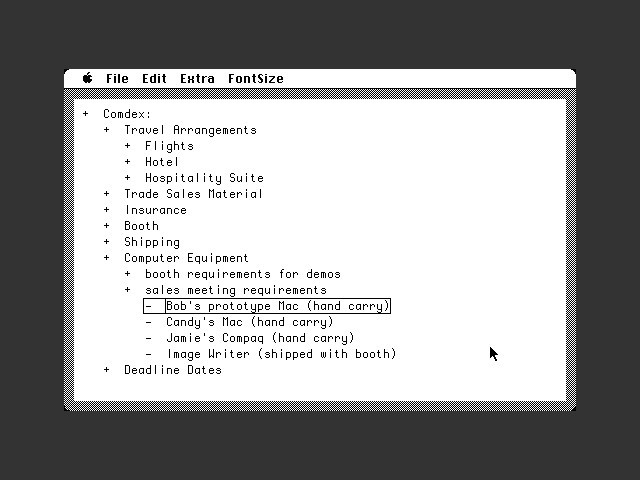
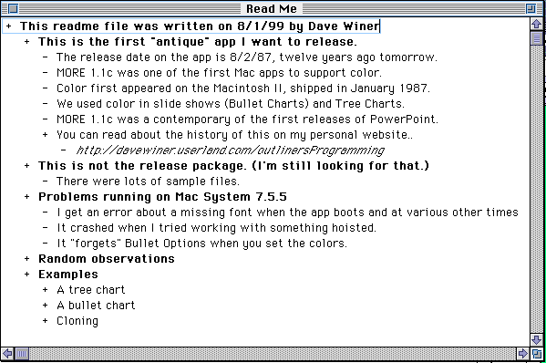
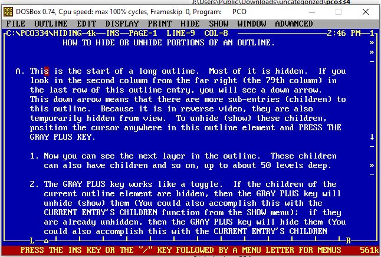
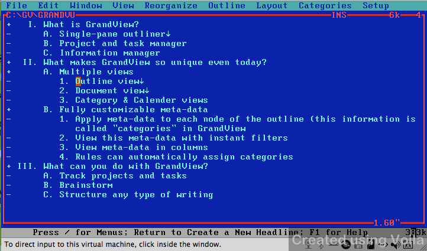

*Last update: December 7th, 2020*

This is a chronological overview of outlining software applications. I will be updating this list incrementally.

# ThinkTank (Mac/PC, 1984-1987)

## Summary

Released in June 1984, ThinkTank 128 was one the first electronic outlining applications and the precursor to MORE.

## Screenshots

https://www.youtube.com/watch?v=OFp0Y1DukdQ

## Platforms

Mac/PC

## Lifetime

1984 - 1987

## Features

- Expand / collapse items
- Drag and drop items to re-order
- Hoisting

## More Reading

http://scripting.com/dwiner/outlinersProgramming.html
# More (Mac, 1986)

## Summary

Outliner with the ability to switch between the outline view, a tree chart view and a chart list view (which was suitable for presentations).

## Platforms

Macintosh

## Lifetime

1986

## Features

- Hide / unhide subordinate items
- Drag and drop items to re-order
- Tree chart view
- Bullet chart view
- Hierarchy-level-specific text formatting
## Screenshots

# PC-Outline (DOS, 1987)

## Summary

An MSDOS text outliner program created by Brown Bag Software and a competitor to ThinkTank.

## Screenshots

## Platforms

MSDOS

## Lifetime

? - 1987

## Features

- Move items
- Mark / unmark items
- Copy / move marks
- Join / divide items
- Sort outline level
- Multi-window (up to 9, resizable)
- Printing options

## More Reading

https://www.danielsays.com/ssg-dossw-pco334.html

# GrandView (DOS, 1987-1990)

## Summary

First Outliner supporting color.
## Screenshots

## Features

- Named ranges

## More Reading

https://welcometosherwood.wordpress.com/2009/10/10/grandview/
https://www.atarimagazines.com/compute/issue139/114_GrandView_20.php
https://books.google.ch/books?id=Eq0wALnyM_MC&q=%22grandview%22+%22friend%22+outliner&pg=PA34&redir_esc=y#v=snippet&q=%22grandview%22%20%22friend%22%20outliner&f=false

# ECCO Pro (Windows, 1993-1997)

## Summary

## Lifetime

## Screenshots

# Action Outline (Windows, 2000-2012)

## Summary

Basic Windows outliner

## Developer

Green Parrots Software

## Screenshots

# ConnectedText (Windows, 2011-2016)

## Summary

Personal Wiki, very basic editor. Generate graphs on a page and being able to embed Python scripts that run on the page. A document with an outline view is one of ConnectedText's features.

## Status

Discontinued

## Screenshots

## More Reading

# InfoQube

## Summary

Information Manager with support for multiple views, including an outliner. Free Windows app built as a successor to Ecco Pro. An outliner with columns, allowing search, filter, sort. Includes a rich text pane for larger content / web links. Fully portable. Tries to do everything which Connected Text can do and more but without the markup language so everything is done through a GUI and with tables of properties and context menus.

## Screenshots

## Features

- Gantt Charts
- Pull in data from remote databases
- Integrated Calendar
- Integrated Web Clipper
- Spreadsheet Capabilities
    - Pivot Tables
    - Charts
- Item Formatting
    - Rule Based
- Markdown support

## More Reading

- https://www.reddit.com/r/design_critiques/comments/ggocxu/infoqube_outliner_free_app_your_comments_please/
- https://pauljmiller.wordpress.com/2018/03/29/a-review-of-infoqube/

# MyInfo (Windows, 2000-today)

## Summary

Bare bones outliner. 

## Status

Active

## Screenshots

## More Reading

- https://en.wikipedia.org/wiki/MyInfo
- http://www.loosewireblog.com/2006/03/an_outliner_tha.html

# Accordia IT

# Zoot

# InfoSelect

# Microsoft Word Outline View

# UltraRecall

# Jot+

# TreePad

# Inspiration

# The Brain

# Vim Outliner

# Little Outliner (Web-based)

# Workflowy (Web-based)

# Dynalist (Web-based)

# Roam Research

# LeoEditor

http://leoeditor.com/

