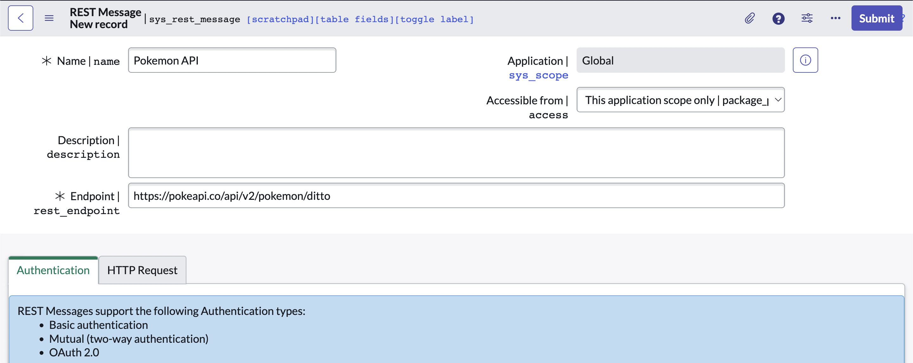
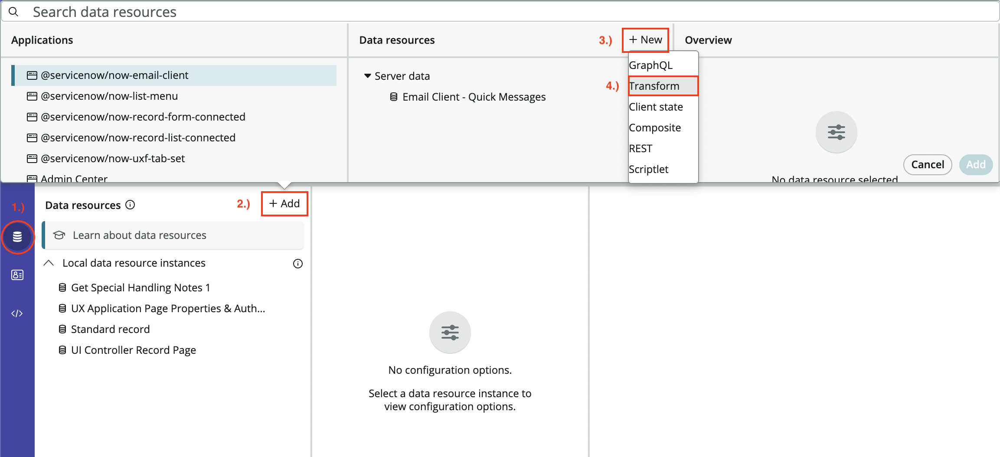
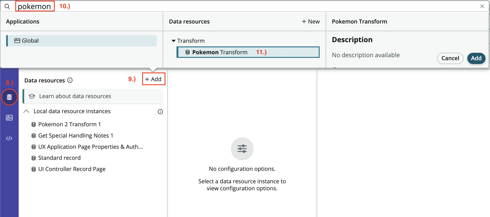
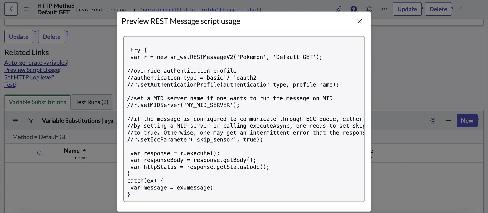
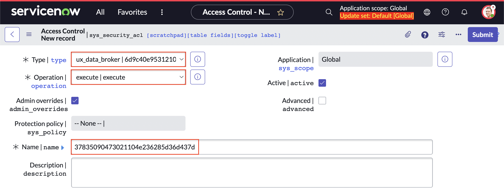
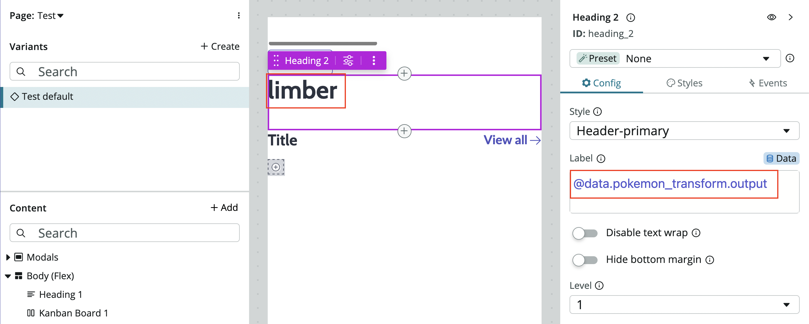

<YouTube youTubeId="3SgY8E6T7oA" />

Watch the video tutorial or read the step by step article below.

In this article I describe how you can make a a REST API request (e.g. GET) to an external API endpoint from within a Now Experience configured through ServiceNow's UI Builder.

UI Builder ships with an out-of-box Data Transform for internal REST API requests i.e. requests to Scripted REST Endpoints on the same instance. If, however, you want to pull data from an external resource, you'll need to create a new custom Transform Data Resource. This article will teach you how.

## High level summary

1. Create a new REST Message record to call the API
2. Create a new Data Resource of type _Transform_ and call the API from within it
3. Bind the output of the Transfrom Data Resource to a component and use it in UI Builder

## Step 1: Create a REST Message

1. In the Application Navigator navigate to REST Message
2. Click "New" to create a new REST Message
3. Provide a name and the REST endpoint and configure additional settings if necessary
4. Click "Submit" to save



5. Navigate back to your newly created REST Message record (if ServiceNow redirected you)
6. Navigate to the bottom of the record and open the "Default GET" HTTP Methods record that was created automatically


In the "Default GET" record you can scroll down to the "Related Links" section. Here you can "Test" the REST call and make sure your settings are correct.


## Step 2: Create a new Transform Data Resource



1. Click on "Data" in the left side-bar to open the Data Resources pane.
2. Click + Add to add a Data Resource
3. Click + New to create a new Data Resource
4. Select Transform from the dropdown list


5. Give the new Data Transform (`sys_ux_data_broker_transform`) a name and leave the Script section empty for now.
6. Click Submit or open the Context Menu and click Save

Back in UI Builder you should get a warning that "Data resources have changed outside of UIB".


7. Click "Update page" to reload the Data Resources

Now our new Transform Data Resource should be available for adding to our Experience.

8. Once again click Data in the left menu
9. Click "+ Add"
10. And start typing the name of your newly created Transform in the search bar.

Your newly created Transform Data Resource should appear in the results.

11. Select your Transform and click Add



We now have a Transform Data Resource, which is a record with a Script field which allows us to run server-side scripts. We'll use this to invoke the external API using a the Rest Message record we set up in step 1.

12. Navigate to your the REST Message (`sys_rest_message`) record you created in Step 1. Once you've confirmed the correct settings click "Preview Script Usage" from the "Related Links" section on the "Default GET" HTTP Method record. This will pop up some boilerplate code for you to invoke the REST call you just configured.



At this point you can choose to copy the boilerplate code over into Background Scripts to test and tweak it to your liking.

The Pokemon API I'm using has a response which looks something like this:

```json
{
  "abilities": [
    {
      "ability": {
        "name": "limber",
        "url": "https://pokeapi.co/api/v2/ability/7/"
      },
      "is_hidden": false,
      "slot": 1
    },
    {
      "ability": {
        "name": "imposter",
        "url": "https://pokeapi.co/api/v2/ability/150/"
      },
      "is_hidden": true,
      "slot": 3
    }
  ]
  // ...
}
```

I'm only interested in grabbing the first `ability` from the `abilities` array, so I tweak the boilerplate REST Message code as follows:

```js
try {
  var r = new sn_ws.RESTMessageV2("Pokemon", "Default GET")

  var response = r.execute()
  var responseBody = response.getBody()
  var httpStatus = response.getStatusCode()

  return JSON.parse(responseBody).abilities[0].ability.name // Adding this line
} catch (ex) {
  var message = ex.message
}
```

Then I wrap the above tweaked boilerplate code into a specific function that is required by the Transform Data Resource (`sys_ux_data_broker_transform`) and save this in the Script field on the Transform Data Resource record we created in Step 1.

```js
function transform(input) {
  // added function wrapper
  try {
    var r = new sn_ws.RESTMessageV2("Pokemon", "Default GET")

    var response = r.execute()
    var responseBody = response.getBody()
    var httpStatus = response.getStatusCode()

    return JSON.parse(responseBody).abilities[0].ability.name
  } catch (ex) {
    var message = ex.message
  }
} // added function wrapper
```

13. After saving you'll get a notification inside UI Builder notifying you that you don't have permission to execute this data resource.


This is kind of weird behavior from ServiceNow, but it's expected behavior. What you need to do is to create an ACL for the Transform Data Resource.

14. Copy the Sys ID of the Transform Data Resource and navigate to the Access Controls (`sys_security_acl`) table. Here we want to create a new ACL. In order to do so we need to first elevate our roles.

15. Click on your profile icon on the top right corner to expose the menu. Click on "Elevate role" and select "security_admin" and click "Update".

16. Now with the Elevated Role the "New" button should appear on the top right of the Access Controls (`sys_security_acl`) table. Click it to create a new ACL.

17. For "Type" select `ux_data_broker` and for Operation select `execute`. For the "Name" field paste in the Sys ID of the Transform Data Record you created earlier. Finally click Submit to save the record and click on Elevate Role again to revert to normal access.



Now our Transform Data Resource, when executed, will invoke the REST Message and return the parsed result. You can verify this by reloading UI Builder and clicking on your Transform Data Resource. It should show you a preview of the response in the right pane.


All that's left now is to bind that response to a component in our UI.

## Step 3: Bind the Transfrom Data Resource to a component

1. Add a "Heading" component and in the Configuration Pane choose "None" under the "Preset" dropdown menu.

2. Still in the Configuration Pane hover over the "Label" field for the three icons to appear (Static, Bind data, Use script). Choose "Bind data". Then dot walk starting from the `@data` object into the output of your Transform Data Resource. Finally you'll see the output appear in the Header component (the text "limber" in this case).



## Final notes

- Transform Data Resources not only allow you to make REST API calls, they allow you to run any arbitrary server-side code.
- In this tutorial we didn't look at _when_ the Transform Data Resource gets executed (and thus when an API call gets made). By default the setting is set to "eager" which means it runs on page load. This can be set to "explicit" which allows you to trigger the Data Resource manually e.g. through an event.
