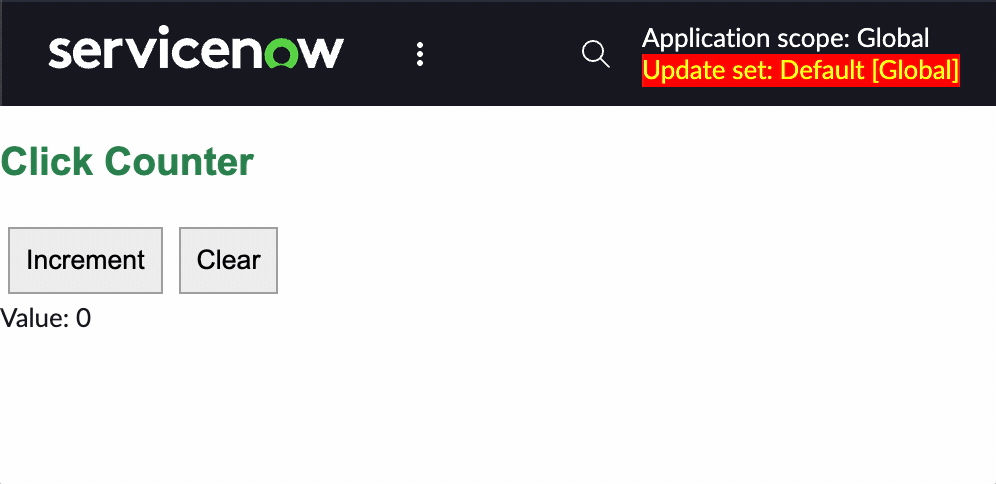
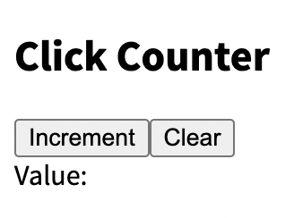
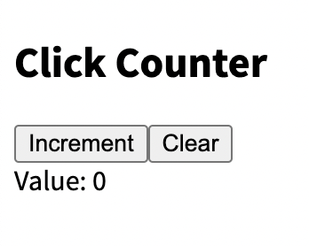
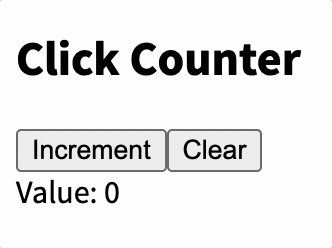
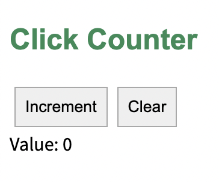
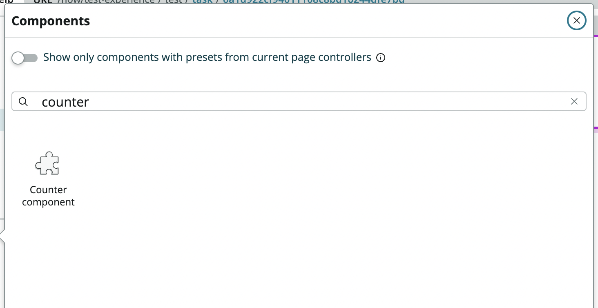

<YouTube youTubeId="rLqIjxjgnjk" />

The official docs (as of this writing) for creating a custom Next Experience "Counter Component" can be found [here](https://developer.servicenow.com/dev.do#!/reference/next-experience/tokyo/ui-framework/examples/counter), but they seem to be outdated. In some cases that means steps are [wrong](https://www.servicenow.com/community/developer-forum/setinitialstate-not-working-in-now-cli-develop-but-works-in/m-p/1455415) and it's not clear what the correct step should be. In this tutorial I hope to clarify such gaps by sharing what I did to achieve the same results.

To be clear, this is what we'll be making:



## Step 1: Set up the project

Create a clean directory and scaffold the project with this command:

```bash
snc ui-component project --profile personal-dev --name @<your-company-name>/counter-component --description "A counter."
```

Now run the following to install all the dependencies.

```bash
npm install
```

Now run the following command to run the local development server:

```bash
snc ui-component develop
```

The ServiceNow CLI should give you some feedback in the terminal, including the local URL where it's running the component. You can CTRL/CMD + Click that URL to open it in your browser.

```bash
ℹ ｢wds｣: Project is running at http://localhost:8081/
```

There won't be anything there yet, but now we're ready for the next step.

## Step 2: Defining the UI

Inside `src/x-<number>-counter-component/index.js` we can expand our return function to look like this:

```js
return (
  <div>
    // Add this 👇
    <h2>Click Counter</h2>
    <span>
      <button type="button">Increment</button>
    </span>
    <span>
      <button type="button">Clear</button>
    </span>
    <div>Value: </div>
    //
  </div>
)
```

In the official docs they mention a disclaimer here:

> Disclaimer: In this example, we use the native button tag rather then the now-button component. In a component designated for production, you would import and utilize Now Design System components.

At this point you should just have an empty, static counter that doesn't do anything.



We'll make it interactive in the next step.

## Step 3: Making the UI interactive

To make the component interactive we first need to add some state.

To do this first add an `initialState` property to the object we pass to `createCustomElement()` at the bottom of our `index.js` file. Set this property to an object containing the state we desire — in this case we want to set a `tally` variable to `0`.

```js
//...
createCustomElement("x-733577-counter-component", {
  renderer: { type: snabbdom },
  view,
  styles,
  // Add this 👇
  initialState: {
    tally: 0,
  },
  //
})
```

This gives us access to the `tally` state value inside the component. Since the `state` variable is already being passed into our component we can access it by [destructuring](https://developer.mozilla.org/en-US/docs/Web/JavaScript/Reference/Operators/Destructuring_assignment) the `state` object inside our component.

```js
const view = (state, { updateState }) => {
	const { tally } = state;    // Destructuring the state object into the tally variable
	return (
    // ...
}
```

Now that we've set the initial value for `tally` we can use it in our render template.

```js
const view = (state, { updateState }) => {
  const { tally } = state
  return (
    <div>
      <h2>Click Counter</h2>
      <span>
        <button type="button">Increment</button>
      </span>
      <span>
        <button type="button">Clear</button>
      </span>
      <div>Value: {tally}</div> // Using tally here
    </div>
  )
}
```

The result should be a component which displays `0` as the tally value.



Next we need to use the buttons to manipulate the state.

For this we can use the `on-click` attribute on the `button` elements. But we cannot simply pass it a function, because a simple function (e.g. updateState) would be executed any time the component is reloaded — not just every time the button is clicked.

Instead we need to pass a function which itself returns a function.

The function that gets returned needs to invoke [updateState](https://developer.servicenow.com/dev.do#!/reference/next-experience/sandiego/ui-framework/main-concepts/state#state-updates) in order to manipulate the state.

So we do something like this:

```js
const view = (state, { updateState }) => {
  const { tally } = state
  return (
    <div>
      <h2>Click Counter</h2>
      <span>
        <button
          type="button"
          on-click={() => updateState({ tally: tally + 1 })}
        >
          Increment
        </button>
      </span>
      <span>
        <button type="button" on-click={() => updateState({ tally: 0 })}>
          Clear
        </button>
      </span>
      <div>Value: {tally}</div>
    </div>
  )
}
```

The result should be an interactive counter:



## Step 3: Styling the component

When we scaffolded the project it should have created a `styles.scss` file in `src/x-<number>-counter-component`. In order to style our component we can just place our desired styling there.

```scss
// src/x-<number>-counter-component/styles.scss
.counter {
  margin: 15px;
}

h2 {
  font-family: Arial;
  color: seagreen;
}

button {
  margin: 4px;
  padding: 8px;
  border: 1px solid darkgray;
}

h3 {
  align-content: center;
  font-size: 16px;
  margin: 12px;
}
```

Here is the end result:



## Step 4: Deploying the component to our instance

Before we deploy our component let's make sure we change its name from the default "My Component". You can do this in the `now-ui.json` file at the root of your project directory.

```json
{
  "components": {
    "x-733577-counter-component": {
      "innerComponents": [],
      "uiBuilder": {
        "associatedTypes": ["global.core", "global.landing-page"],
        "label": "Counter component", // Change this
        "icon": "document-outline",
        "description": "My counter component", // and possibly this
        "category": "primitives"
      }
    }
  },
  "scopeName": "x_733577_jessems_0"
}
```

Save it and run the following command in your terminal to deploy.

```bash
snc ui-component deploy
```

If you then navigate to UI Builder the component should be available for you to select.



## More resources

- [The original official counter tutorial](https://developer.servicenow.com/dev.do#!/reference/next-experience/tokyo/ui-framework/examples/counter)
- [Component State (Official Docs)](https://developer.servicenow.com/dev.do#!/reference/next-experience/tokyo/ui-framework/main-concepts/state)
- [Official ServiceNow GitHub repository with custom Next Component Examples](https://github.com/ServiceNowDevProgram/now-experience-component-examples/tree/quebec)
- [setInitialState() is mentioned in a tutorial, but isn't an existing method](https://www.servicenow.com/community/developer-forum/setinitialstate-not-working-in-now-cli-develop-but-works-in/m-p/1455415)
