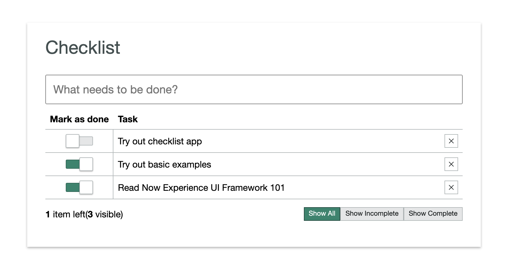
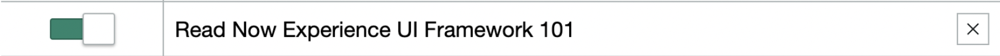
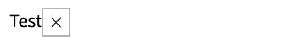
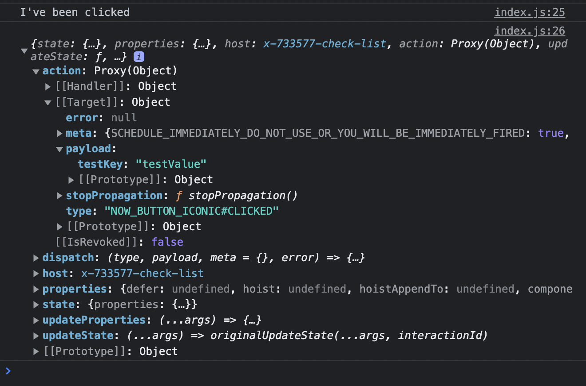
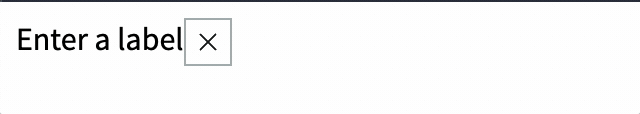
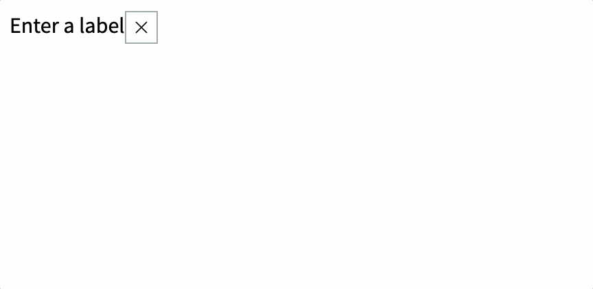
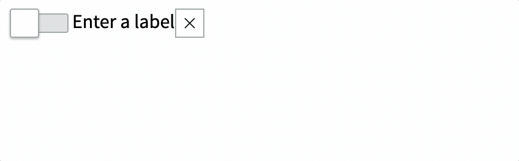

This is a tutorial for building a checklist component using ServiceNow's Next Experience UI framework.



The code for the checklist comes from ServiceNow themselves. They have an [official tutorial](https://developer.servicenow.com/dev.do#!/reference/next-experience/utah/ui-framework/examples/checklist) — of sorts — for this component, but I found it to be a bit skimpy on the details. I'm writing this tutorial to fill in the gaps and to help me understand the component better.

When you've completed the tutorial you'll end up with (essentially) the same code as ServiceNow has in [their respository](https://github.com/ServiceNowDevProgram/now-experience-component-examples/tree/quebec). Perhaps with some minor changes to make sure it works.

## Before we begin

This tutorial assumes you have your local development set up for Next Experience custom component development. You can read my guide on how to set up your local environment for next custom component development [here](https://jessems.com/setting-up-local-environment-now-experience-custom-component-development).

## Setup

1. Make sure you have `nvm` installed and switch to Node 14 using nvm `nvm use 14`

2. Set up your project with `snc ui-component project --name @<your-username>/check-list --description 'A check list'`. When I did this after not having developed for a while, I got the the `keytar.node` error, for which I've written a post [here](cannot-find-module-keytar-node). What works for me is uninstalling the `ui-component` snc extension (`snc extension remove --name ui-component`) and reinstalling it again (`snc extension add --name ui-component`).

3. Run `npm install`

4. Run `snc ui-component develop` to run the instance locally

## Step 1: The label and delete button

We want to start off by building a check list item component. The overall check list will consist of a list of check list items. Each check list item will have a toggle, a label and a delete button.

It should look something like this:



We will use some of ServiceNow's out-of-box components like [now-toggle](https://developer.servicenow.com/dev.do#!/reference/next-experience/utah/now-components/now-toggle/overview) and [now-button](https://developer.servicenow.com/dev.do#!/reference/next-experience/utah/now-components/now-button-iconic/overview).

So let's install those first:

```bash
npm install @servicenow/now-toggle @servicenow/now-button
```

Let's start by creating a label and a delete button. We'll use a simple static text for the label and we'll use the `now-button` component for the delete button.

We can look up the [usage](https://developer.servicenow.com/dev.do#!/reference/next-experience/paris/now-components/now-button-iconic/usage) and [API](https://developer.servicenow.com/dev.do#!/reference/next-experience/paris/now-components/now-button-iconic/overview) documentation on the ServiceNow developer portal. (Note the menu on the ServiceNow website as of this writing is broken, so use the links above)

The button API exposes several properties that we'll use.

- `disabled` takes a boolean and mutes the button color and disables user click interactions if set to `true`.
- `icon` defines the icon to be displayed. We'll use the `close-outline` icon, but you can pick any icon from the icon library.
- `size` sets the size of the button. We'll use `sm` which is the smallest size.
- `variant` Sets the icon style. We'll use `tertiary` which is designated for "actions that are optional or less important to a workflow.

There's one additional property which we'll set which is not specific to the now-button component: `appendtoPayload`. This is an undocumented property which adds an object's key-value pairs to the click event payload. For now we'll just add a test object to understand how it works.

```jsx
// ...other import statements
import "@servicenow/now-button"

const view = (state, { updateState }) => {
  return (
    <div className="now-checklist-item">
      Test
      <now-button-iconic
        icon="close-outline"
        tooltipContent="Delete"
        size="sm"
        variant="tertiary"
        appendtoPayload={{ test: "test" }}
      />
    </div>
  )
}

// createCustomElement call
```

This should give us something like this:



The iconic button is clickable out of the box, but I like to make sure things work before I move on. So let's add an [action handler](https://developer.servicenow.com/dev.do#!/reference/next-experience/tokyo/ui-framework/main-concepts/action-handlers) to our `createCustomElement` call and console log something when the button is clicked.

To create an action handler for the iconic button's click event, all we need is the event's name, which we can get from the API: `NOW_BUTTON_ICONIC#CLICKED`.

```jsx
createCustomElement("x-733577-check-list", {
  actionHandlers: {
    "NOW_BUTTON_ICONIC#CLICKED": e => {
      console.log("I've been clicked")
      console.log(e)
    },
  },
  renderer: { type: snabbdom },
  view,
  styles,
})
```

This should result in `I've been clicked` getting logged into the browser console when the button is clicked as well as the event object.

If we then drill down into `action.[[Target]].payload` we can see the test object we added to the payload. Later we'll be able to use this for sending along an ID.



## Step 2: Configuring the view function

The view function is called with two arguments: `state` and `helpers`.

`state` is an object that contains the state of the component. `helpers` is an object that contains helper functions that can be used to update the state of the component.

The helpers object contains the following functions:

- `updateState` - Updates the state of the component
- `dispatch` - Used to emit actions when users interact with a component
- `updateProperties` - Updates the properties of the component

In our `createCustomElement` call let's add a parameter for `properties`. We'll use this to declare that we'll be using a `label` and an `editing` property and we'll set their default values.

```jsx
createCustomElement("x-733577-check-list", {
  // ... other parameters
  properties: {
    label: {
      default: "Enter a label",
    },
    editing: {
      default: false,
    },
  },
  // ... other parameters
})
```

We can access these properties through the `state` variable, which gets passed through the `view` function. We can update these properties with the `updateProperties` function in the second parameter, the helpers object.

```jsx
const view = (state, { updateProperties }) => {
  // ... view body
}
```

Let's update the `view` function to use the `label` and `editing` properties.

```jsx
const view = (state, { updateProperties }) => {
  const {
    properties: { label, editing },
  } = state
  // ... view body
}
```

Now let's use the `updateProperties` to create a function that will update the `editing` property.

```jsx
const view = (state, { updateProperties }) => {
  const {
    properties: { label, editing },
  } = state

  const setEditing = editing => updateProperties({ editing })

  // ... view body
}
```

Now we can use the `setEditing` function to update the `editing` property when the span is double clicked. We can use the `on-dblclick` attribute for this. We'll also add a ternary operator to the span's text to show that we're in edit mode by appending "(editing)" to the label.

```jsx
const view = (state, { updateProperties }) => {
  const {
    properties: { label, editing },
  } = state

  const setEditing = editing => updateProperties({ editing })

  return (
    <div className="now-checklist-item">
      <span
        className="now-checklist-item-cell"
        on-dblclick={() => setEditing(true)}
      >
        {editing ? label + " (editing)" : label}
      </span>
      <now-button-iconic
        icon="close-outline"
        tooltipContent="Delete"
        size="sm"
        variant="tertiary"
        appendToPayload={{ testKey: "testValue" }}
      />
    </div>
  )
}
```

Here is the final code of our view function:

```jsx
// Pass state and helpers object, destructure updateProperties from helpers
const view = (state, { updateProperties }) => {
  // Get label and editing variables via destructuring the state object
  const {
    properties: { label, editing },
  } = state

  // Create a function that calls updateProperties with the new value for editing
  const setEditing = editing => updateProperties({ editing })

  return (
    <div className="now-checklist-item">
      <span
        className="now-checklist-item-cell"
        on-dblclick={() => setEditing(true)} // Call setEditing with true when the span is double clicked
      >
        {editing ? label + " (editing)" : label}
      </span>
      <now-button-iconic
        icon="close-outline"
        tooltipContent="Delete"
        size="sm"
        variant="tertiary"
        appendToPayload={{ testKey: "testValue" }}
      />
    </div>
  )
}
```

## Step 3: Using an input field

Now that we have a way to update the `editing` property, let's use it to show an input field when the span is double clicked.

First let's encapsulate our span and make it dedicated to displaying the label (as opposed to the input field). We'll call it `labelCell`.

```jsx
const labelCell = (
  <span
    className="now-checklist-item-cell"
    on-dblclick={() => setEditing(true)}
  >
    {label}
  </span>
)
```

Then in our return declaration where we just took out our span, let's add a ternary operator that will show the label when editing is `false` and the input field when editing is `true`.

```jsx
return (
  <div className="now-checklist-item">
    {editing ? inputCell : labelCell} {/* 👈 Add this */}
    <now-button-iconic
      icon="close-outline"
      tooltipContent="Delete"
      size="sm"
      variant="tertiary"
      appendToPayload={{ testKey: "testValue" }}
    />
  </div>
)
```

We just encapsulated our label span element as `labelCell`, now all we need is an `inputCell` to replace the span with an input field when `editing` is `true`. We can use the built-in `on-blur` attribute to call `setEditing` with `false` when the input field loses focus.

We can do something like this:

```jsx
const inputCell = (
  <span className="now-checklist-item-cell" role="cell">
    <input
      className="now-checklist-item-input"
      value={label}
      on-blur={() => setEditing(false)}
    />
  </span>
)
```

This gives us the following result:



## Step 4: Listening for keyboard keys

We've got a task item for which we can enter and exit edit mode, but perhaps you noticed ENTER and ESCAPE don't do anything. Let's fix that.

We can use the `on-keydown` attribute to listen for keyboard events. For now we'll use the updateProperties helper to update the state. Later on, when we want to update the state of the parent component, we'll use the `dispatch` helper to emit an action.

Here's the new new `inputCell` in `index.js`:

```jsx
const inputCell = (
  <span className="now-checklist-item-cell" role="cell">
    <input
      className="now-checklist-item-input"
      value={label}
      on-keydown={({ keyCode, target: { value: label } }) => {
        const newLabel = label.trim()
        if (keyCode === 13 && newLabel) {
          updateProperties({ label: newLabel })
          setEditing(false)
        } else if (keyCode === 27) {
          setEditing(false)
        }
      }}
      on-blur={() => setEditing(false)}
    />
  </span>
)
```

And here's what the result looks like:



There's one more little improvement that I would like to make before we continue.

Notice how when we double click on the label, the input field is not focused. We can fix that by using the lifecycle hook [`hook-insert`](https://developer.servicenow.com/dev.do#!/reference/next-experience/utah/ui-framework/main-concepts/view#lifecycle-hooks-dom) to focus the input field when it is inserted into the DOM. We simply grab the `elm` (Element) property from the `vnode` argument and call `focus()` on it.

```jsx
const inputCell = (
  <span className="now-checklist-item-cell" role="cell">
    <input
      className="now-checklist-item-input"
      value={label}
      hook-insert={vnode => vnode.elm.focus()} // 👈 Add this
      on-keydown={({ keyCode, target: { value: label } }) => {
        const newLabel = label.trim()
        if (keyCode === 13 && newLabel) {
          updateProperties({ label: newLabel })
          setEditing(false)
        } else if (keyCode === 27) {
          setEditing(false)
        }
      }}
      on-blur={() => setEditing(false)}
    />
  </span>
)
```

Now when you double click the input field should be in focus.

## Step 5: Adding the toggle

Now that we have a way to edit the label, let's add a toggle to mark the task as complete.

In our createCustomElement declaration, let's add a new property called `active` and set it to `false` by default.

```jsx
createCustomElement("x-733577-check-list", {
  actionHandlers: {
    "NOW_BUTTON_ICONIC#CLICKED": e => {
      console.log("I've been clicked")
      console.log(e)
    },
  },
  view,
  properties: {
    label: {
      default: "Enter a label",
    },
    editing: {
      default: false,
    },
    // 👇 Add this
    active: {
      default: false,
    },
    //
  },
  renderer: { type: snabbdom },
  styles,
})
```

Then where we're destructuring the state into properties, let's include the `active` property.

```jsx
const {
  properties: { label, editing, active },
} = state
```

Now we can use the `active` property to set the `checked` attribute on the `now-toggle` element.

```jsx
return (
  <div className="now-checklist-item">
    <span className="now-checklist-item-cell -center" role="cell">
      <now-toggle checked={active} disabled={editing} />
    </span>
    {editing ? inputCell : labelCell}
    <now-button-iconic
      icon="close-outline"
      tooltipContent="Delete"
      size="sm"
      variant="tertiary"
      appendToPayload={{ testKey: "testValue" }}
    />
  </div>
)
```

The result should look like this:


