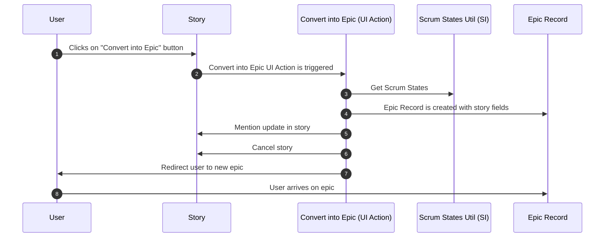

## Description

This would be a high level description of the user story.

## Acceptance Criteria

/

## Implementation Plan

Here I would include implementation plan.

```mermaid

sequenceDiagram
autonumber

participant user as User
participant story as Story
participant convertIntoEpicUIAction as Convert into Epic (UI Action)
participant scrumStatesUtilSI as Scrum States Util (SI)
participant epicRecord as Epic Record

link convertIntoEpicUIAction: Convert into Epic @ https://dev168935.service-now.com/nav_to.do?uri=sys_ui_action.do?sys_id=80e97a04ef301000a7450fa3f82256c0
link scrumStatesUtilSI: Scrum States Util @ https://dev168935.service-now.com/nav_to.do?uri=sys_script_include.do?sys_id=30d6f144cb50330078e8dcbcf7076d6c

user->>story: Clicks on "Convert into Epic" button
story->>convertIntoEpicUIAction: Convert into Epic UI Action is triggered

convertIntoEpicUIAction->>scrumStatesUtilSI: Get Scrum States

convertIntoEpicUIAction->>epicRecord: Epic Record is created with story fields

convertIntoEpicUIAction->>story: Mention update in story
convertIntoEpicUIAction->>story: Cancel story

convertIntoEpicUIAction->>user: Redirect user to new epic
user->>epicRecord: User arrives on epic

```

## Estimation

/
